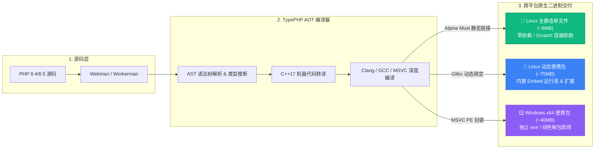

<div align="center">

# ⚡ TypePHP Webman

**让 PHP 拥有 Go / Rust 般的分发与部署体验**

基于 [TypePHP](https://www.swoole.com/)（Swoole 研发的 PHP AOT 静态编译器），将 **Webman / Workerman** 项目静态编译为原生二进制机器码（ELF / PE），实现极致启动速度、内存隔离与零依赖交付。

<p align="center">
  <a href="https://github.com/Tinywan/tinywan-typephp-webman/releases"></a>
  <a href="https://hub.docker.com/r/tinywan/typephp-linux-x64"></a>
  <a href="https://hub.docker.com/r/tinywan/typephp-linux-x64-static"></a>
  
  
  <a href="LICENSE"></a>
</p>

</div>


## 📖 目录

- [核心架构](#-核心架构)
- [核心特性](#-核心特性)
- [编译产物一览](#-编译产物一览)
- [快速开始（直接下载使用）](#-快速开始直接下载使用)
  - [1. Linux 纯静态单文件（🌟 推荐）](#1-linux-纯静态单文件-推荐)
  - [2. Linux 动态便携包](#2-linux-动态便携包)
  - [3. Windows x64 绿色包](#3-windows-x64-绿色包)
- [本地开发与编译构建](#-本地开发与编译构建)
  - [方式一：Docker 镜像一键编译（🌟 推荐）](#方式一docker-镜像一键编译-推荐)
  - [方式二：宿主机原生工具链打包](#方式二宿主机原生工具链打包)
- [服务验证与访问](#-服务验证与访问)
- [AOT 关键适配与技术细节](#-aot-关键适配与技术细节)
- [开源协议](#-开源协议)


## 🚀 核心架构




## ✨ 核心特性

- ⚡ **AOT 原生机器码**：直接将 PHP 代码编译为原生汇编机器码，脱离传统 Zend VM 解释执行，毫秒级冷启动。
- 📦 **真正的零依赖单文件**：Musl 全静态 Linux 二进制体积仅约 **6 MB**，无需系统安装 PHP、glibc 或任何扩展，可在 Scratch 最小化容器中直跑。
- 🐳 **开箱即用官方 Docker 镜像**：预置完整编译工具链、SDK 与内置预编译库，一键挂载即可编译任意 Webman 项目。
- 🧩 **Webman 生态无缝适配**：支持路由、中间件、自定义进程、静态资源托管与模板引擎渲染。
- 🤖 **全自动化 GitHub CI/CD**：跨平台矩阵构建，Push Tag 即可自动完成编译、校验并在 GitHub Releases 发布多架构安装包。


## 📦 编译产物一览

| 发布包名称 | 目标系统 | 编译类型 | 大小 | 特点说明 | 推荐度 |
| :--- | :--- | :--- | :---: | :--- | :---: |
| `typephp-webman-php8.5-linux-x64-static.tar.gz` | Linux x64 | **全静态链接 (Musl libc)** | **~6 MB** | **单一 ELF 文件**，零外部依赖，兼容 CentOS / Ubuntu / Alpine 等所有发行版与空镜像 | ⭐⭐⭐⭐⭐ |
| `typephp-webman-php8.5-linux-x64.tar.gz` | Linux x64 | 动态链接 (Glibc) | ~75 MB | 包含 PHP Embed 运行时及所有依赖动态库 (`.so`)，通过 `start.sh` 启动 | ⭐⭐⭐ |
| `typephp-webman-php8.5-windows-x64.zip` | Windows x64 | 原生 PE 动态包 | ~40 MB | 包含主执行文件 `webman-server.exe`、核心 DLL 与静态资源 | ⭐⭐⭐⭐ |


## 📥 快速开始（直接下载使用）

前往 [GitHub Releases](https://github.com/Tinywan/tinywan-typephp-webman/releases) 下载适合您操作系统的预编译包。**宿主机无需安装 PHP 或任何扩展**。

### 1. Linux 纯静态单文件（🌟 推荐）

解压即为纯静态 ELF 二进制程序，无任何动态链接库，直接运行：

```bash
# 1. 下载解压
wget https://github.com/Tinywan/tinywan-typephp-webman/releases/download/v0.0.12/typephp-webman-php8.5-linux-x64-static.tar.gz
tar -zxvf typephp-webman-php8.5-linux-x64-static.tar.gz
cd typephp-webman-linux-x64-static

# 2. 赋予执行权限
chmod +x webman-server

# 3. 控制命令
./webman-server start        # 前台运行
./webman-server start -d     # 守护进程（后台）运行
./webman-server status       # 查看状态
./webman-server stop         # 优雅停止
./webman-server restart      # 重启服务
```

> [!TIP]
> 全静态单文件极其适合构建极简 Docker 镜像，只需基于 `scratch` 基础镜像 `COPY` 进去即可启动，镜像体积小于 10MB！

### 2. Linux 动态便携包

适用于 glibc 环境，解压后通过配套的引导脚本启动：

```bash
tar -zxvf typephp-webman-php8.5-linux-x64.tar.gz
cd typephp-webman-linux-x64
chmod +x start.sh webman-server.bin

./start.sh start -d     # 后台启动
./start.sh status       # 查看状态
./start.sh stop         # 停止服务
```

### 3. Windows x64 绿色包

1. 下载 `typephp-webman-php8.5-windows-x64.zip` 并解压到本地；
2. 在 CMD 或 PowerShell 中进入解压目录运行：
   ```cmd
   webman-server.exe start
   ```


## 🔨 本地开发与编译构建

如果您需要二次开发业务代码、调整路由或添加控制器，请通过以下方式进行编译打包：

### 方式一：Docker 镜像一键编译（🌟 推荐）

官方维护了预置完整 AOT 工具链、系统编译依赖及静态 SDK 的 Docker 构建镜像，**无需在本地配置 C++、PHP 8.5 环境**，只需将项目根目录挂载至容器即可秒级编译：

| 官方 Docker 镜像 | 编译模式 | 产物形态 | 说明 |
| :--- | :--- | :--- | :--- |
| [`tinywan/typephp-linux-x64:v0.7.0`](https://hub.docker.com/r/tinywan/typephp-linux-x64) | 动态链接 (glibc) | 便携目录 (`dist/`) | 内置 TypePHP v0.7.0、预编译 `libphpx.so`，一键生成 `dist/webman-server.bin` |
| [`tinywan/typephp-linux-x64-static:v0.7.0`](https://hub.docker.com/r/tinywan/typephp-linux-x64-static) | 全静态链接 (musl) | 单可执行文件 (`dist/`) | 内置 TypePHP v0.7.0、预编译 Musl SDK，一键生成全静态 `dist/webman-server` |

#### 单行命令直接编译

> [!TIP]
> **各终端路径变量兼容写法**：
> - **PowerShell**：使用 `"${PWD}:/app"`
> - **Linux / macOS / Git Bash**：使用 `"$(pwd):/app"`
> - **Windows CMD**：使用 `"%cd%:/app"`

**1. 编译 Linux 动态便携包 (输出至本地 `dist/` 目录)**
```bash
# PowerShell (Windows)
docker run --rm -v "${PWD}:/app" tinywan/typephp-linux-x64:v0.7.0

# Linux / macOS / Git Bash
docker run --rm -v "$(pwd):/app" tinywan/typephp-linux-x64:v0.7.0
```

**2. 编译 Linux 全静态单文件 (输出至本地 `dist/webman-server`)**
```bash
# PowerShell (Windows)
docker run --rm -v "${PWD}:/app" tinywan/typephp-linux-x64-static:v0.7.0

# Linux / macOS / Git Bash
docker run --rm -v "$(pwd):/app" tinywan/typephp-linux-x64-static:v0.7.0
```

**3. 调试模式：进入容器命令行交互**
```bash
docker run --rm -it -v "${PWD}:/app" tinywan/typephp-linux-x64:v0.7.0 bash
```

#### 通过 Docker Compose 编排编译

```bash
# 编译动态便携包
docker compose -f docker-compose.build.yml run --rm linux-dynamic

# 编译全静态单文件
docker compose -f docker-compose.build.yml run --rm linux-static
```


### 方式二：宿主机原生工具链打包

<details>
<summary><b>展开查看在宿主机手动安装工具链打包流程</b></summary>

#### 环境前置要求
- **PHP**：PHP 8.4 或 8.5（需开启 ZTS / Embed SAPI）
- **AOT 引擎**：安装 `swoole/typephp`（提供 `tpc` 命令）
- **编译器**：GCC / Clang（支持 C++17），Windows 需 Visual Studio 2022 MSVC

#### 1. Linux 原生编译
```bash
# 动态便携版本打包
./package.sh

# 全静态版本打包（建议在 Alpine 环境运行）
./package.sh --full-static
```

#### 2. Windows MSVC 原生编译
```cmd
# 编译并打包至 dist/ 目录
package.bat
```

</details>


## 🌐 服务验证与访问

服务默认监听 `8787` 端口，启动成功后可通过浏览器或 curl 验证：

| 端点接口 | 请求地址 | 响应内容说明 |
| :--- | :--- | :--- |
| **默认首页** | `http://127.0.0.1:8787/` | Webman 欢迎主页 |
| **RESTful 接口** | `http://127.0.0.1:8787/user/1` | JSON 格式数据响应 |
| **AOT 模板页面** | `http://127.0.0.1:8787/view` | 经 AOT 静态优化编译的视图渲染 |


## 💡 AOT 关键适配与技术细节

在将 Webman 框架移植到 TypePHP AOT 静态编译环境时，本项目解决了以下核心兼容性问题：

1. **SAPI 兼容改造**：默认 Workerman 仅允许在 CLI SAPI 下运行，扩展为支持在 `PHP_SAPI === 'embed'` 模式下自适应引导启动。
2. **符号与注解解耦**：解决 AST 静态解析期路由类与属性注解同名冲突，优化类加载查找路径。
3. **闭包严格签名对齐**：统一系统信号处理器与退出回调函数入参为可变签名，适配 PHP 8.5 严格类型约束。
4. **视图引擎占位化改造**：重构 `Raw.php` 模板渲染逻辑，用确定性占位替换动态 `extract()` 变量注入，确保编译期符号确定性。


## 📄 开源协议

本项目基于 [MIT License](LICENSE) 协议开源。
欢迎提 Issue 与 PR 共同完善 PHP 原生二进制分 발생态！
