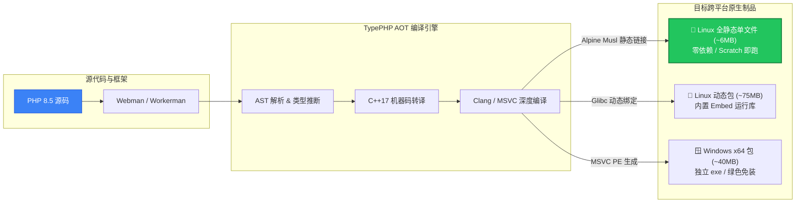

<div align="center">

# ⚡ TypePHP Webman

**让 PHP 拥有 Go / Rust 般的分发体验**

基于 [TypePHP](https://www.swoole.com/)（Swoole 研发的 PHP AOT 静态编译器），将 **Webman / Workerman** 项目直接静态编译为原生二进制机器码（ELF / PE），实现极致性能与零依赖部署。

<p align="center">
  <a href="https://github.com/Tinywan/tinywan-typephp-webman/releases"></a>
  
  
  
  
</p>

</div>

## 🚀 核心架构与流程



## ✨ 核心特性

- ⚡ **AOT 原生编译**：PHP 代码直接编译为原生汇编机器码，启动速度提升数倍，脱离传统 PHP 解释器。
- 📦 **零依赖全静态**：提供基于 Musl Libc 的全静态 Linux 单文件（~6MB），无需外部 libc/glibc，兼容 CentOS / Ubuntu / Alpine 及 Scratch 容器。
- 🛠️ **全流程 CI/CD**：集成 GitHub Actions 自动化构建矩阵，跨平台 Tag 即刻自动发布 Releases。
- 🧩 **生态无缝兼容**：支持 Webman 经典路由、中间件、JSON 响应、静态资源托管与模板渲染。

## 📥 快速开始（直接下载使用 - 推荐）

前往 [GitHub Releases](https://github.com/Tinywan/tinywan-typephp-webman/releases) 下载最新版本的预编译包，解压后即可直接运行，**本地无需安装 PHP、Composer 或任何 C/C++ 编译工具链**。

### 方式一：Linux 纯静态单文件版（🌟 强烈推荐）

基于 Musl libc 全静态链接，体积仅 **~6 MB**，不依赖宿主机 glibc 版本，可运行于 **CentOS、Ubuntu、Debian、Alpine** 等几乎所有 x86_64 Linux 发行版，也极为适合打包放入 Docker Scratch 镜像。

```bash
# 1. 下载最新静态版本压缩包（以实际发布版本为准）
wget https://github.com/Tinywan/tinywan-typephp-webman/releases/download/v0.0.12/typephp-webman-php8.5-linux-x64-static.tar.gz

# 2. 解压
tar -zxvf typephp-webman-php8.5-linux-x64-static.tar.gz
cd typephp-webman-linux-x64-static

# 3. 赋予执行权限并直接启动
chmod +x webman-server

# 前台调试模式启动
./webman-server start

# 守护进程（后台）模式启动
./webman-server start -d

# 服务生命周期管理
./webman-server status   # 查看运行状态
./webman-server stop     # 优雅停止
./webman-server restart  # 重启服务
```

> 💡 **提示**：全静态包解压后根目录即为纯静态单文件 ELF 可执行程序 `webman-server`，无需额外的 Shell 包装脚本，直接执行即可。

### 方式二：Linux 动态链接版

适用于传统的 glibc Linux 环境，包内包含了完整的 PHP Embed 共享库和扩展依赖。

```bash
# 1. 解压
tar -zxvf typephp-webman-php8.5-linux-x64.tar.gz
cd typephp-webman-linux-x64

# 2. 赋予执行权限
chmod +x start.sh webman-server.bin

# 3. 通过 start.sh 启动（自动注入 LD_LIBRARY_PATH 与环境配置）
./start.sh start
./start.sh start -d
./start.sh status
./start.sh stop
```

### 方式三：Windows x64 版

1. 前往 Releases 下载 `typephp-webman-php8.5-windows-x64.zip`；
2. 解压到本地任意目录；
3. 双击 `webman-server.exe` 或在 CMD / PowerShell 中执行：
   ```cmd
   webman-server.exe
   ```

### 🌐 访问与验证

服务默认监听 `8737` 端口，启动成功后打开浏览器访问：

| 端点 | 地址 | 说明 |
| :--- | :--- | :--- |
| **首页** | `http://127.0.0.1:8737` | 默认欢迎页面 |
| **API 接口** | `http://127.0.0.1:8737/user/1` | JSON 响应接口 |
| **视图页面** | `http://127.0.0.1:8737/view` | AOT 静态优化模板渲染 |

## 📦 Release 发布产物对比矩阵

| 产物文件名 | 适用平台 | 链接类型 | 体积 | 特性说明 | 推荐度 |
| :--- | :--- | :--- | :--- | :--- | :---: |
| `typephp-webman-php8.5-linux-x64-static.tar.gz` | Linux x64 | **全静态 (Musl libc)** | **~6 MB** | 零外部动态依赖，单文件 ELF，兼容任意 Linux 与 Scratch 容器 | ⭐⭐⭐⭐⭐ |
| `typephp-webman-php8.5-linux-x64.tar.gz` | Linux x64 | 动态链接 (glibc) | ~75 MB | 自包含 PHP embed 运行环境及扩展共享库，使用 `start.sh` 引导 | ⭐⭐⭐ |
| `typephp-webman-php8.5-windows-x64.zip` | Windows x64 | 动态链接 (PE) | ~40 MB | 包含可执行程序、依赖 DLL、配置及视图文件 | ⭐⭐⭐⭐ |

## 🔨 本地源码打包构建（开发者）

如果您需要基于源码二次开发、修改业务代码或添加自定义依赖，可使用以下命令进行编译打包。

<details>
<summary><b>🔍 查看开发者构建步骤与命令详情</b></summary>

### 环境要求

- PHP >= 8.5
- [TypePHP](https://www.swoole.com/) 编译工具链
- C++17 编译器（Linux: GCC/Clang；Windows: Visual Studio MSVC）

### 1. Windows 打包构建 (MSVC)

```cmd
# 仅编译生成二进制文件
build.bat

# 编译并打包到 dist/ 目录 (包含 exe, dll, 配置与视图资源)
package.bat
```

打包完成后，进入 `dist/` 目录运行 `webman-server.exe`。

### 2. Linux 打包构建 (Clang / GCC)

```bash
# 动态链接版本打包 (产物输出至 dist/)
./package.sh

# 纯静态版本打包 (基于 Alpine Musl libc 静态编译，生成单文件 dist/webman-server)
./package.sh --full-static
```

> **提示**：建议在 Alpine 容器内使用 `--full-static` 构建全静态版本，以保证 musl-libc 依赖的完全静态绑定。

</details>

## 💡 框架关键适配记录

在将 Webman 移植到 TypePHP AOT 静态编译环境时，本项目解决了以下核心兼容性问题：

1. **SAPI 兼容**：默认 Workerman 仅允许 CLI 模式，本项目扩展支持在 `PHP_SAPI === 'embed'` 模式下正常运行。
2. **符号与注解解耦**：消除路由与属性注解同名类在 AST 静态解析下的命名冲突。
3. **闭包严格签名**：统一信号处理器与退出回调形参为可变参数，适配 PHP 8.5 严格模式。
4. **模板引擎优化**：重构 `Raw.php`，采用静态友好的占位渲染方案，替代动态 `extract()` 语法。


